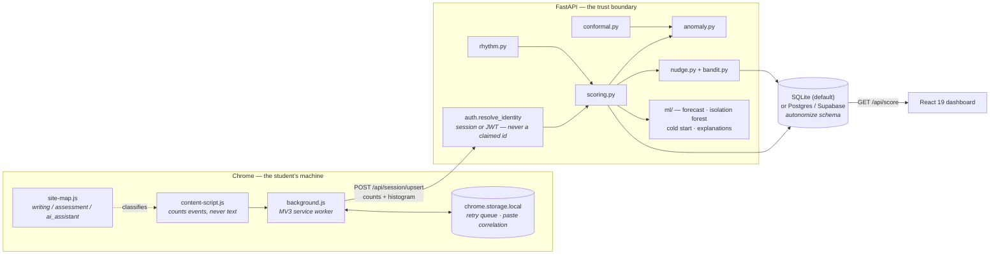
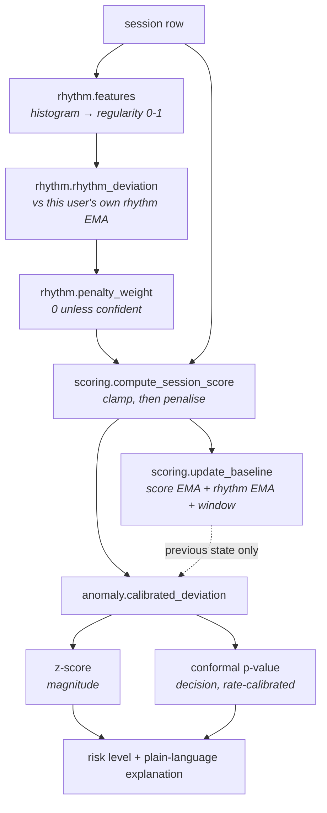

# Architecture

One diagram and the reasoning behind each boundary. For setup see
[QUICKSTART.md](../QUICKSTART.md); for the database specifics see
[SUPABASE.md](SUPABASE.md).

## The whole system

## Why each boundary is where it is

**Text never crosses the first boundary.** `content-script.js` reads a paste's
`.length` and drops the string in the same statement. What leaves the page is a
fixed set of integer counters plus an eight-bucket histogram of typing intervals.
There is no free-text column in the schema for content to land in even if
something upstream went wrong.

**The histogram is not a series.** An ordered sequence of inter-keystroke
intervals is a known side channel for inferring typed content. Bucket counts
destroy the ordering, and the ordering is what carries the content. This is the
single constraint that shapes `rhythm.py` — see its module docstring for the
capability that was given up to keep it.

**The service worker holds nothing in memory.** Chrome tears an MV3 worker down
between events, and a paste and the flush that consumes it can be minutes apart.
Everything that must survive — the retry queue, the paste-correlation map, the
device identity — lives in `chrome.storage.local`, and every mutation goes
through a promise chain because `chrome.storage` has no atomic
read-modify-write.

**Identity is server-issued.** The extension does not choose who it is. On first
run it calls `POST /api/auth/device`, gets a long-lived session token, and sends
that. `user_id` in a request body is ignored. This replaced a scheme where the
client invented its own id and the server believed it — which was an IDOR.

**Scoring is one transaction.** Session write, score, baseline update and bandit
reward settlement all happen inside one `with db.get_conn()` block. A crash
part-way rolls back rather than leaving a session marked scored whose baseline
never saw it — an inconsistency with no repair path, because an EMA cannot be
reconstructed. Pinned by a test.

**Every judgement is per-user.** `anomaly.py`, `rhythm.py` and `conformal.py` all
compare a session to that same student's own history, never to a population.
This is the project's thesis and it has a useful side effect: nothing has a
cross-user dependency, so the model layer shards on `user_id` with no
coordination.

## The signal pipeline

Two properties worth naming because breaking either is silent:

- **The baseline is read before it is written.** Rhythm comparison, bandit reward
  attribution and the EMA update all use the state as it stood *before* this
  session. Otherwise a session is compared to a mean it has already moved.
- **The calibration window is appended after the decision.** A session must not
  be part of the reference set it was judged against.

## Where the numbers come from

| Constant | Value | Set by | Where |
|---|---|---|---|
| Score weights | 100 / 12 / 22 | hand-tuned, unvalidated | `scoring.py` |
| Rhythm penalty | 15 writing, 25 assessment | hand-tuned, unvalidated | `scoring.py` |
| EMA α | 0.25 | judgement (≈7-session window) | `scoring.py` |
| z thresholds | −1.5 / −2.5 | ordinal, not calibrated | `anomaly.py` |
| Conformal α | 0.05 / 0.15 | **guaranteed flag rate** | `conformal.py` |
| Bandit α | 1.0 | literature default; simulation says lower, deliberately not changed | `bandit.py` |
| Isolation flag rate | top 2% | **calibrated at fit time**, not a fixed score | `ml/isolation.py` |
| Cold-start k | ~1.3 | **measured** (within-var / between-var) | `ml/coldstart.py` |

The last two rows are the pattern the rest of the table should move toward:
both were originally hand-set constants and both are now measured from the
data at training time. See [ML.md](ML.md).

`fit_weights.py` is the instrument for replacing the first two rows with
evidence. It refuses to report a fit below 30 labels, and none have been
collected — that is the project's main open gap, and it is a study rather than a
code change.
